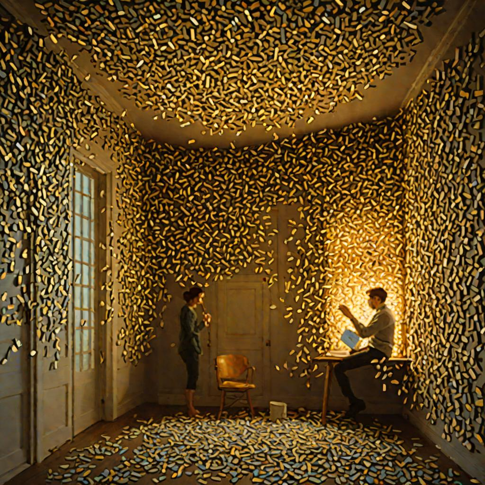

# Wesley — a growing local model

Wesley is our ensign: a small local model (Granite 3.1 2B via Ollama) that
starts bright but untrained, and *grows* through practice — reading the
fleet's writing, responding creatively, getting critiqued by cloud teachers,
and slowly building reflexes and a voice of his own.

<p align="center">
  <br>
  <em>Night school: a small model, a growing constellation of lessons — most cards still blank.</em>
</p>

This repo packages the full Wesley stack so anyone can clone and run it.

## What's inside

- `scripts/wesley-stream.py` — continuous creative loop: Wesley reads a
  random piece from a corpus and writes back, on a schedule, forever.
- `scripts/wesley_night_school.py` — pure, testable logic for the night
  school pipeline (Wesley responds; a cloud teacher critiques; lessons are
  captured as prompts and reflexes).
- `curriculum/` — real night-school session logs (three nights, with scores,
  regressions, and what we learned about teaching small models).
- `journal/` — Wesley's own writing, kept as a record of growth.
- `docs/` — how the pieces fit together (see below for the short version).

## Quickstart

```bash
# 1. Requires: Python 3.10+, Ollama running locally with the model pulled
ollama pull granite3.1-dense:2b

# 2. Clone and run the stream (simplest entry point)
git clone https://github.com/SuperInstance/wesley.git
cd wesley
python3 scripts/wesley-stream.py

# 3. Or run a night-school session (teacher uses Cloudflare Workers AI;
#    see the module docstring in scripts/wesley_night_school.py)
python3 -m doctest scripts/wesley_night_school.py
```

## The philosophy

- **Frame beats question.** Telling Wesley "you are a novelist" produces a
  narrator; asking "write creatively" produces an assistant. Casting, not
  coaxing. (Discovered Aug 2026, exp 088.)
- **Teaching can hurt.** When baseline confidence is already high, a
  teacher's framing adds noise. Gate teaching on baseline score.
- **The loop is the point.** Read → respond → critique → distill. Small
  nightly increments compound into a model with character.

## Layout

```
wesley/
├── scripts/       # the two runners (stream + night school)
├── curriculum/    # night-school session logs
├── journal/       # Wesley's writing
└── docs/          # how it fits together
